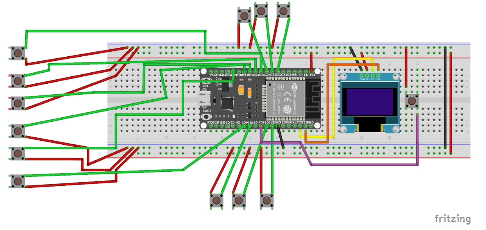

# ESP32 Bluetooth Keyboard with OLED Display and LED Effects

This project is a custom Bluetooth keyboard using the ESP32 NodeMCU. It includes an OLED screen for visual feedback and RGB LED lighting effects using a WS2812B LED strip. The project is coded in C++ and uses several libraries to manage the keyboard input, OLED display, and LED effects.

## Features

- **Bluetooth Keyboard**: The ESP32 is recognized as a Bluetooth keyboard and can send keystrokes to connected devices.
- **OLED Display**: A 1.3-inch 128x64 SH1106 OLED display is used to show the active profile and the Bluetooth connection status.
- **LED Effects**: A WS2812B ARGB LED strip with 11 LEDs provides visual effects that react to the keyboard input.
- **Multiple Profiles**: The keyboard supports multiple gaming profiles, including predefined layouts for games like *VALORANT*, *League of Legends*, and *Counter-Strike: Global Offensive*.
- **Custom Inputs**: Each profile has a different set of key bindings, and users can switch between profiles with the press of a button.
- **Easily Add/Modify Profiles**: The code allows for easy addition, modification, or deletion of profiles, with customizable key bindings for each profile.

## Hardware Used

- **ESP32 NodeMCU**: The main microcontroller used to manage BLE (Bluetooth Low Energy) and peripherals.
- **WS2812B ARGB LED Strip**: A strip of addressable LEDs to create lighting effects.
- **SH1106 OLED Display (1.3-inch, 128x64 resolution)**: Displays the active profile and Bluetooth status.
- **Keyboard Switches (Cherry MX)**: Custom mechanical switches for input.
- **Push Button**: Used to switch between profiles.

## Libraries Used

The following libraries were used in this project to manage the hardware components:

1. **[ESP32-BLE-Keyboard](https://github.com/T-vK/ESP32-BLE-Keyboard)**: Enables the ESP32 to be recognized as a Bluetooth keyboard by the host device.
2. **[SSD1306 for SH1106 OLED Display](https://github.com/vlast3k/Arduino-libraries/tree/master/SSD1306)**: Used to control the SH1106 OLED display and show information like the active profile and Bluetooth status.
3. **[FastLED](https://github.com/FastLED/FastLED)**: Manages the LED strip animations and lighting effects.

## Wiring and Setup

The following image illustrates the wiring for all components:

Here’s how the components are wired:

- **OLED Display**:  
  - SDA pin: GPIO 23  
  - SCL pin: GPIO 22  
  - I2C Address: 0x3C
- **LED Strip**:  
  - Data Pin: GPIO 17  
  - LED Count: 11 LEDs  
  - LED Type: WS2811
- **Keyboard Buttons**:  
  - Connected to GPIO pins 18, 19, 16, 12, 14, 27, 26, 25, 33, 32, 35, and 34.
- **Profile Change Button**:  
  - Connected to GPIO 5.

## Installation

1. Clone this repository to your local machine.
2. Install the necessary libraries:
   - ESP32-BLE-Keyboard
   - SSD1306 for SH1106 OLED Display
   - FastLED
3. Upload the code to your ESP32 using the Arduino IDE or PlatformIO.

## Usage

Once the ESP32 is powered on, it will begin broadcasting as a Bluetooth keyboard. You can connect to it from any Bluetooth-enabled device (such as a PC or smartphone). 

- The OLED screen will display the current Bluetooth connection status and the active profile.
- Press the buttons to send keystrokes according to the active profile.
- The LED strip will display different lighting effects based on the keyboard input.
- You can switch between profiles by pressing the dedicated profile change button.

## Profiles

The project includes 3 profiles by default:
- **VALORANT**  
- **League of Legends**  
- **CS:GO**

Each profile has a unique key mapping. The active profile is displayed on the OLED screen.

### Adding or Modifying Profiles

The code is designed to easily add, modify, or delete profiles with custom key bindings. You can define a new profile by adding it to the `tabProfil` array, and each profile can have its own set of key bindings.

To modify the keys, you can refer to the official Arduino documentation for the available key values:  
**[Arduino Key Reference](https://www.arduino.cc/reference/en/language/functions/usb/keyboard/keyboardmodifiers/)**

## LED Effects

The project uses the FastLED library to create dynamic lighting effects:
- **Sinelon Effect**: A single LED sweeps back and forth, leaving fading trails.
- **Random Colors**: The LED strip displays random colors when a key is pressed.

## License

This project is licensed under the MIT License.
